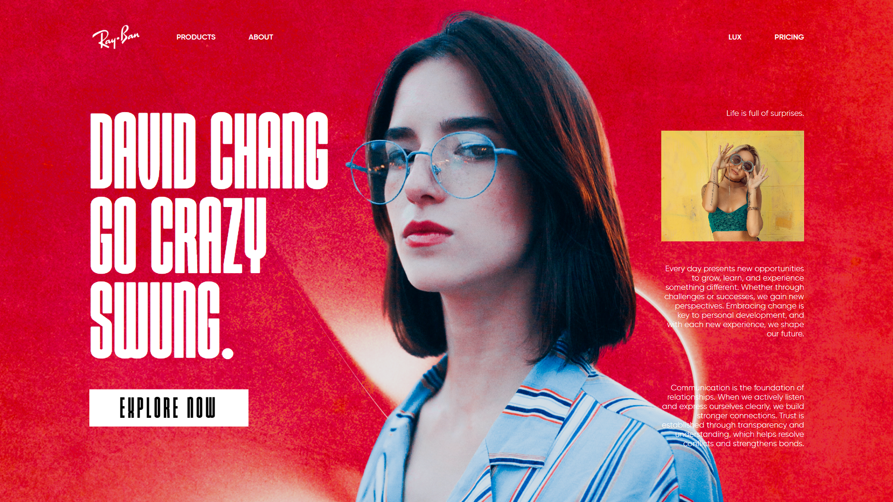

# Ray-Ban - Landing Page

This project is a visually striking showcase for Ray-Ban, designed with dynamic animations and a fully responsive layout. Built using HTML, CSS, and JavaScript, it integrates Shery.js for advanced image effects and GSAP for seamless, high-performance animations.

With elegant transitions, smooth interactions, and a sleek modern aesthetic, the website delivers an immersive user experience, making it both engaging and visually compelling.

## Features

- **Dynamic Image Effects**: Leverages Shery.js to deliver stunning, dynamic image transitions.
- **Responsive Design**: Ensures a seamless experience across all screen sizes, from desktops to mobile devices.
- **Custom Navigation**: Includes a sleek, responsive navigation bar optimized for smooth browsing on any device.

## Tech Stacks

- HTML5
- CSS3
- JavaScript (ES6+)
- Shery.js for image effects
- GSAP (GreenSock Animation Platform) for animations
